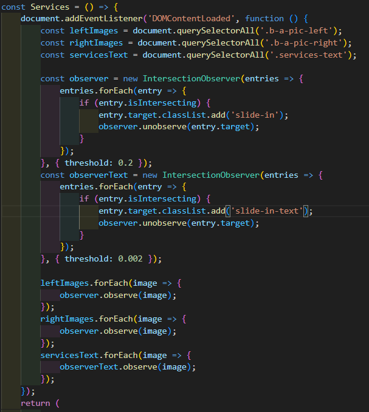
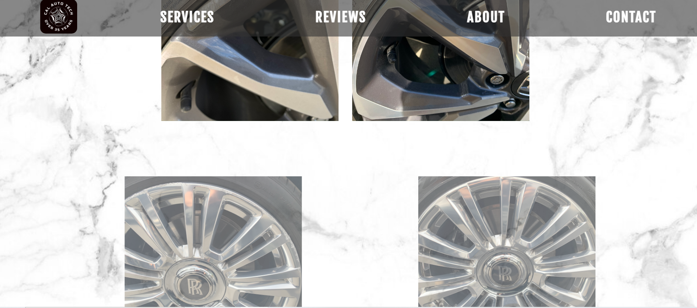
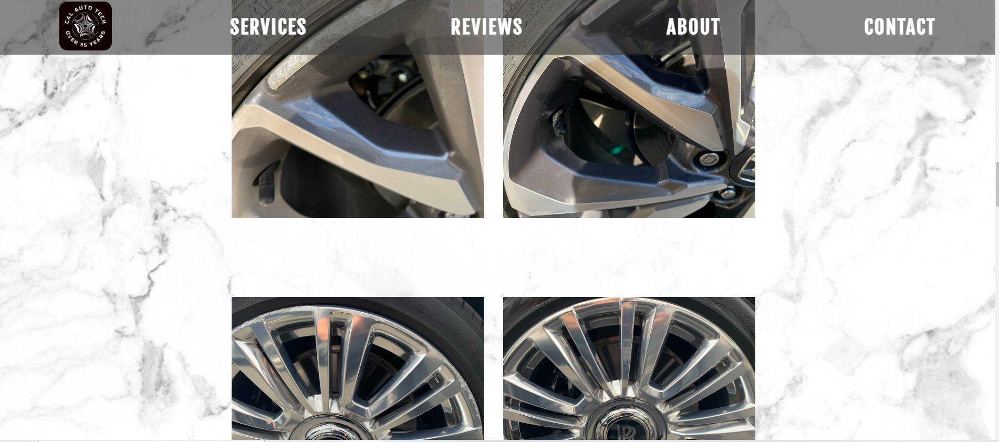

# Welcome To Cal Auto Tech!

### Optimized code base for a rim repair specialists webpage.  
#### Feel free to check out the live site! [Live Site Link](https://nickgentrybjj.github.io/CalAutoTech/)

## Tech Stack!

What began as a vanilla JavaScript project quickly escalated in complexity, leading me to realize that I had underestimated the volume of information and code required to meet the project's goals. Recognizing the need for a more manageable codebase, I opted to refactor the existing project using React.  
This transition to React facilitated smoother implementation of client-suggested changes and enhancements. The result is an organized and cohesive codebase, prioritizing structure, readability, and functionality. 
<code></code>
<code></code>
<code></code> 

#

In this React project, I leveraged npm for package management and utilized webpack as the bundler. These tools played a crucial role in streamlining the development process and optimizing the project's build pipeline, showcasing my proficiency with industry-standard tools and workflows. 
<code></code>
<code></code>
<code></code>

#
## Deployment!

### Deployed and stored using Github!

<code></code>
<code></code>

## Features and Code!

This webpage boasts numerous subtle yet impactful effects that contribute to its polished appearance. Leveraging the capabilities of JavaScript and CSS, the before-and-after pictures shine with elegance. The overarching goal was to immerse the user in an experience reminiscent of strolling through a pristine white-tiled car garage, inspecting the meticulous craftsmanship of our client's work. To achieve this, a custom function was crafted to dynamically add the 'slide-in' class to designated images. As the user's viewport intersects with the designated area, the images gracefully slide into view, enhancing the immersive experience.  

    
## Services Code Snippet

    
## Services Functionality

## Mobile or Desktop Compatability!

    Thanks to its mobile-friendly styling and carefully adjusted layout, our application ensures an intuitive user experience and easy digestion of information, regardless of the device being used for scrolling.

<!-- mobile images and desktop images -->

## Developer

### [Nicholas Gentry](https://www.linkedin.com/in/nicholas-gentry-2721451b2/)

#### Find me Here!
  
    

